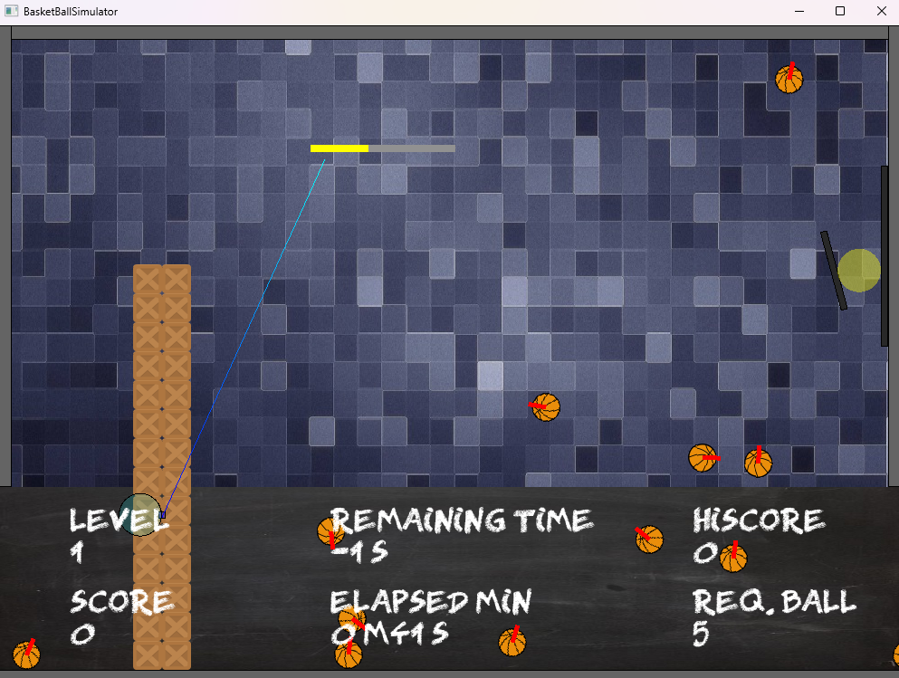

# The Basketball
[](https://github.com/hchia93/ufo-survivor/actions/workflows/build.yml)

The Basketball was one of my university projects. The goal of this project is to show what kind of possible games to make with `Box2D` physics engine.




## Project Structure

```
the-basketball-sfml/
├── CMakeLists.txt         # CMake build configuration
├── vcpkg.json             # Dependency manifest
├── generate.bat           # Install dependencies and generate solution
├── README.md              # This file
├── src/                   # Source code
│   ├── Public/            # Header files
│   └── Private/           # Implementation files
├── resource/              # Game assets
└── generated-vs/          # Generated Visual Studio solution
```

## Prerequisites

To build and run this project, external dependencies are required. The `generate.bat` script will install them accordingly.

| Dependency | Version/Details |
|------------|----------------|
| **SFML**   | Version 3.0.0  |
| **Box2D**  | Version 2.4.1  |

Please take note that Box2D is not yet upgraded to 3.0.1 and its dependencies are handled in CMakeLists.txt.

> **⚠️ Windows-Only Project**
> This project is configured for a **Windows-only** environment.

## Running the Project

### Step 1: Generate Solution

Execute the generator script. This will install dependencies and generate the Visual Studio solution:

```cmd
/generate.bat
```

The solution will be generated in 
```cmd
/generated-vs/
```

### Step 2: Build and Run

Open the generated solution located at:
```cmd
/generated-vs/BasketBallSFML.sln
```

> **⚠️ Note:** Ensure the start-up project is `BasketBallSFML`

## Learning Resources

- [SFML Documentation](https://www.sfml-dev.org/documentation.php)
- [Box2D Documentation](https://box2d.org/documentation/)
